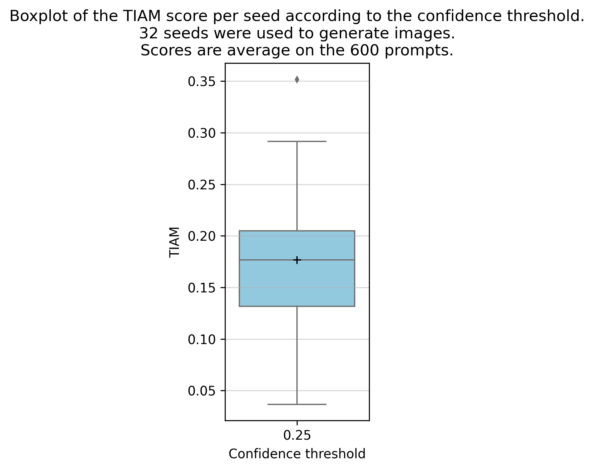
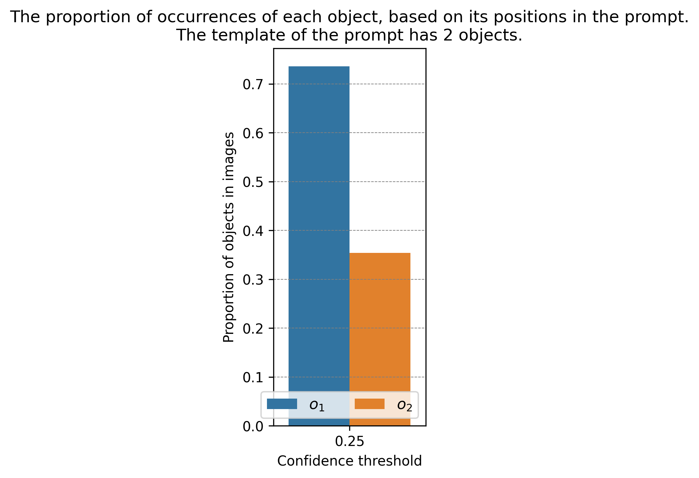
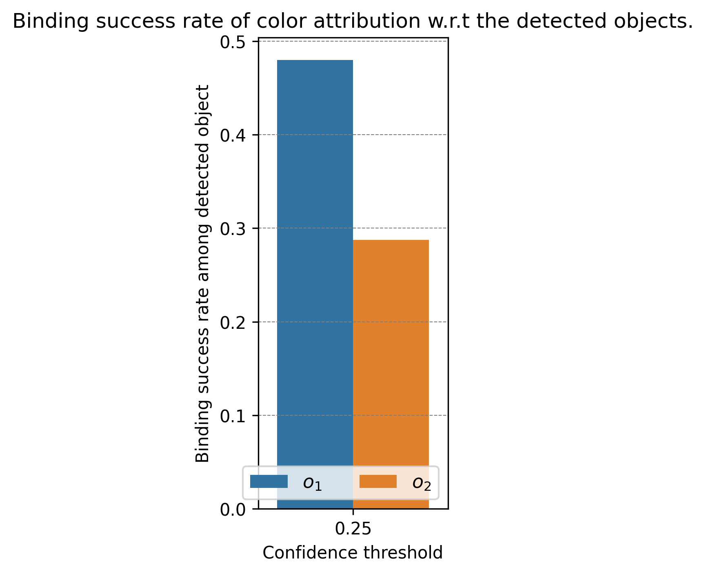
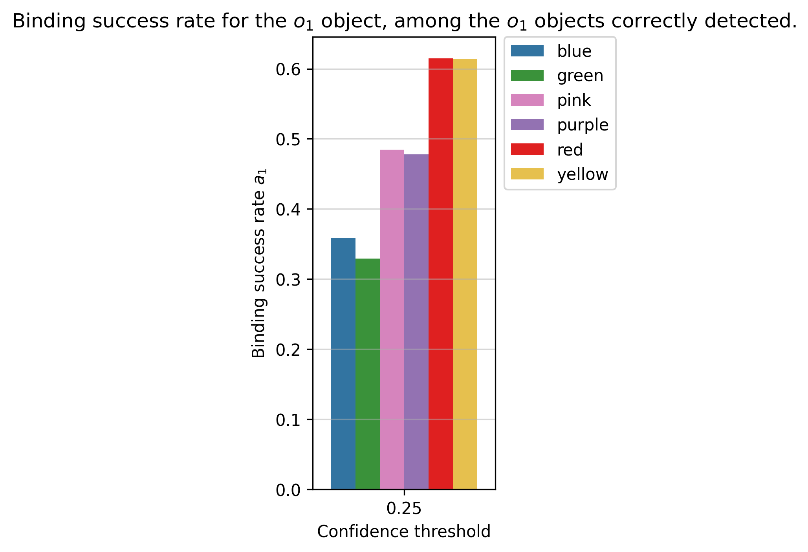
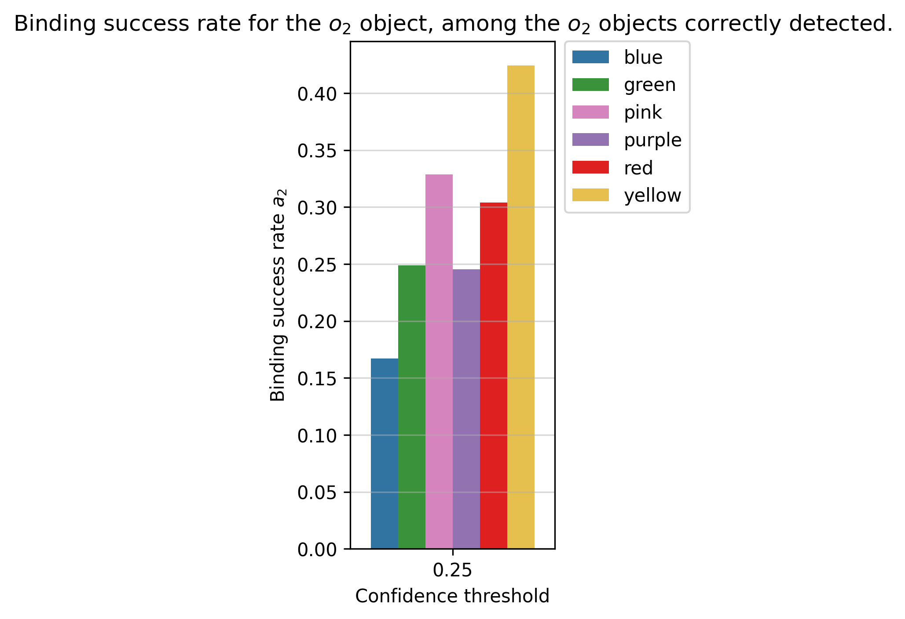

# [WACV 2024] TIAM - A Metric for Evaluating Alignment in Text-to-Image Generation

> Grimal Paul, Le Borgne Hervé, Ferret Olivier, Tourille Julien
> Université Paris-Saclay, CEA, List, F-91120, Palaiseau, France
>
> The progress in the generation of synthetic images has made it crucial to assess their quality. While several metrics have been proposed to assess the rendering of images, it is crucial for Text-to-Image (T2I) models, which generate images based on a prompt, to consider additional aspects such as to which extent the generated image matches the important content of the prompt. Moreover, although the generated images usually result from a random starting point, the influence of this one is generally not considered. In this article, we propose a new metric based on prompt templates to study the alignment between the content specified in the prompt and the corresponding generated images. It allows us to better characterize the alignment in terms of the type of the specified objects, their number, and their color. We conducted a study on several recent T2I models about various aspects. An additional interesting result we obtained with our approach is that image quality can vary drastically depending on the noise used as a seed for the images. We also quantify the influence of the number of concepts in the prompt, their order as well as their (color) attributes. Finally, our method allows us to identify some seeds that produce better images than others, opening novel directions of research on this understudied topic.
>
> [[WACV 2024 pdf]](https://openaccess.thecvf.com/content/WACV2024/html/Grimal_TIAM_-_A_Metric_for_Evaluating_Alignment_in_Text-to-Image_Generation_WACV_2024_paper.html)
>
> [](https://arxiv.org/abs/2307.05134)

## Table of Contents

- [\[WACV 2024\] TIAM - A Metric for Evaluating Alignment in Text-to-Image Generation](#wacv-2024-tiam---a-metric-for-evaluating-alignment-in-text-to-image-generation)
  - [Table of Contents](#table-of-contents)
  - [Running TIAM](#running-tiam)
    - [Setup](#setup)
    - [Generate datasets of prompts](#generate-datasets-of-prompts)
      - [Create a customize prompt dataset](#create-a-customize-prompt-dataset)
    - [Generate images](#generate-images)
      - [Generate images with Stable Diffusion, karlo-v1-alpha (unCLIP) and IF](#generate-images-with-stable-diffusion-karlo-v1-alpha-unclip-and-if)
      - [Prepare your data (generate with another script) for the detection step](#prepare-your-data-generate-with-another-script-for-the-detection-step)
    - [Detection](#detection)
    - [Attribute binding](#attribute-binding)
    - [TIAM evaluation](#tiam-evaluation)
  - [Citation](#citation)
  - [Acknowledgments](#acknowledgments)

## Running TIAM

---

### Setup

Create a conda env with the following command:

```bash
conda env create -f environment.yaml
```

And download :

```python
import nltk

nltk.download('cmudict')
```

---

### Generate datasets of prompts

To generate the datasets of prompts, you can use the config files provided in the `config/prompts_datasets` folder. Use then the following command :

```bash
# for a dataset (that we will use for the experiment)
python run_dataset_generation.py  \
    --save_dir Path2SaveDataset \
    --config path_to/config.yaml \
    --file_name dataset_prompt

# for a text file
python run_dataset_generation.py  \
    --save_dir Path2SaveDataset \
    --config path_to/config.yaml \
    --file_name dataset \
    --txt
```

#### Create a customize prompt dataset

<details>

**<summary> Unroll </summary>**

In the following, we will explain how to create your prompts dataset. In the config file, you can specify one list of objects to fill in a template at different positions or you can provide lists of objects that must be filled in each specified position.

In the template that you will write, you should use the following placeholder:

> `$objectX` will be consider as the object that we want to detect on the image e.g. cat, dog, car, ...
>
> `$adjX` will be consider as adjective associated to the objectX. In our case we will use it to evaluate colors.
>
> `$ind_arX` is the indefinite article (a or an) that it will automatically be replaced by the correct one depending on the object that follow it. e.g. a cat, an orange
>
> `X` an integer that will bind object, adjective

**Case of a template only with objects (w/o attributes)**

You can specify in the config file the params `objects` with a path to a text file with one object per line, or directly the list of objects in the config file.

```yaml
template : $object1 and $object2
generate: OPTION
objects:
    list: [a,b,c]
# or
template : $object1 and $object2
generate: OPTION
objects:
    path: path/to/your/object_list.txt
```

Specify with `OPTION` in your config if you want to generate (even in the case of one object in the template because of the implementation):

- all possible combinations of objects, each object appears one time in each combination (`permutation`)
  - e.g. 'a','b','c', n = 2
    - ('a', 'b'), ('a', 'c'), ('b', 'a')
    - ('b', 'c'), ('c', 'a'), ('c', 'b')
- all possible combinations of objects, each object can be present n times (`combination`)
  - e.g. 'a','b','c', n = 2
    - ('a','a'), ('a','b'), ('a','c'),
    - ('b','a'), ('b','b'), ('b','c'),
    - ('c','a'), ('c','b'), ('c','c')
- combination where is there is no mirror repetition (`ordered_combination`)
  - e.g.'a','b','c', n = 2
  - ('a','b'), ('a','c'), ('b','c')

**Case of multiple object list (useful to combine with attributes)**

In the case of multiple-object lists, you should specify one list per object in your template. We will generate all the config like this, in this case, this is necessary to precise the same name between the object in the template and the name of the list in the config file. e.g.

```yaml
template : $object1 and $object2 and $object3
object1:
    list: [a,b]
object2:
    list: [c,d]
object3:  
    list: [e,f]
```

We will generate 8 combinations:

- a c e
- a c f
- a d e
- a d f
- b c e
- b c f
- b d e
- b d f

Sometimes, you will probably want to generate a dataset where you specify the same list of objects for some params but you do not want an object appears twice or more in the same combination. You can do this by specifying the `unique` param in the config file. You will give a list of objects that you do not want to appear twice or more in the same combination. e.g.

```yaml
template : a $adj1 $object1 and $adj2 $object2
unique: [[object1,object2]]
adj1:
    list: [orange,blue]
object1:
    list: [cat,dog]
adj2:
    list: [orange, blue]
object2:
    list: [cat,dog]
 
```

We will generate 8 combinations:

- a orange cat and orange dog
- a orange cat and blue dog
- a blue cat and orange dog
- a blue cat and blue dog
- a orange dog and orange cat
- a orange dog and blue cat
- a blue dog and orange cat
- a blue dog and blue cat

**Automaticely deal with a/an**

You can specify in your template whether to use 'a' or 'an' in your sentence (e.g. 'a cat' or 'an orange'). To do this, you can include the corresponding indefinite article in your template with the placeholder `$ind_ar`, and specify the index if there is more than one indefinite article in the sentence."  e.g.

```yaml
template : $ind_ar1 $adj1 $object1 and $ind_ar2 $adj2 $object2
unique: [[object1,object2]]
adj1:
    list: [orange,blue]
object1:
    list: [cat,dog]
adj2:
    list: [orange, blue]
object2:
    list: [cat,dog]
```

Please note that it only works if the `ind_ar` is before an object to replace in the template. e.g. `a $ind_ar $object` will work, but `$ind_ar dog` will not.

**Create a dataset for evaluation composition and attribute binding**

In your template, name the adjective you want to apply to the noun with the placeholder `$adj` and specify the **same** index if there is more than one adjective-noun in the sentence. e.g.

```yaml
template : $ind_ar1 $adj1 $object1 and $ind_ar2 $adj2 $object2
unique: [[object1,object2]]
adj1:
    list: [orange,blue]
object1:
    list: [cat,dog]
adj2:
    list: [orange, blue]
object2:
    list: [cat,dog]
```

> :warning: Use `$adjX`-`$objectX`
>
> It is important to use the same index for the adjective and the noun because we will register this information for automatic evaluation of the composition and attribute binding. If there is only one ajd and one noun, you can use `$adj` and `$object`
>
> We can only evaluate the composition and attribute binding if there is only one adjective per noun, and each `$object` have an `$adj`.
>
> Our implementation (for the TIAM score) only work if the objects and colors in the prompt are different. *e.g.* `a red car and a blue dog` will work, but `a red car and a red dog` will not. Thus, we recommend to use the `unique` param to avoid this problem if you want to run the evaluation of composition and attribute binding without modifying the code.
</details>

---

### Generate images

We describe here our implementation if you want to reproduce our results. You can also use the images you have generated with other methods. However, you must respect the format for the dataset of prompts and the images (see [next section](#prepare-your-data-generate-with-another-script-for-the-detection-step)).

#### Generate images with Stable Diffusion, karlo-v1-alpha (unCLIP) and IF

Download the models :

- [Stable-diffusion v1-4](https://huggingface.co/CompVis/stable-diffusion-v1-4)
- [Stable-diffusion v2](https://huggingface.co/stabilityai/stable-diffusion-2-base)
- Deepflloyd IF:
  - Stage 1: [IF-I-L-v1.0](https://huggingface.co/DeepFloyd/IF-I-L-v1.0)
  - Stage 2: [IF-II-M-v1-0](https://huggingface.co/DeepFloyd/IF-II-M-v1.0)
- [Karlo-v1-alpha](https://huggingface.co/kakaobrain/karlo-v1-alpha)

Fill in the path to the model in the config file (in `config/images_generation/*Model*`).

To generate images run the following command:

```bash
python  run_images_generation.py \
    --config config/Path2Config \
    --save_dir Path2directory \
    --dataset Path2PromptDataset \
    --precision float16 \
    --image_per_prompt X \ # number of image generate per prompt
    --batch_size BatchSize \
    --vae_slicing # for stable diffusion https://huggingface.co/docs/diffusers/optimization/fp16#memory-and-speed
```

All your data will be saved in a tar file `images.tar` in `save_dir`, and will *generate `X` images per prompt using the 0 to `X-1` seeds.* In the `save_dir` we will save a copy of the dataset containing the prompts. We will use this to compute and save the score of the experiment.

If you have multiple GPUs, it will use all of them. You must count one main process and one process per GPU.

If a problem occurs during generation, you can resume the generation with the index `index.txt` automatically generated during the generation.  It will only generate the missing images. Precise the tarball and index_file like this:

```bash
python  run_images_generation.py \
    --config config \
    --save_dir Path2directory/images.tar \
    --index_file Path2directory/index.txt \
    --dataset Path2PromptDataset \
    --precision float16 \
    --image_per_prompt X \
    --batch_size BatchSize
```

If you want to overwrite the precedent images in the tar file, you can specify `--overwrite`.

Note that the prompt dataset will be copied into the `save_dir` because we will use it to compute and save the score of the experiment.

#### Prepare your data (generate with another script) for the detection step

<details>

**<summary> Unroll </summary>**

The images must be saved in a tar file, and the images must be saved in the `.png` format. The images must have the name of the prompt that generates it with `_` replacing space. e.g. `a_red_car_and_a_blue_dog_X.png` with `X` the seed number beginning from zero to Max Seed. It is important to respect this format because we will iterate from 0 to `X-1` to find the image in the tarball.

Organize your data like this:

```bash
save_dir
├── images.tar
│   ├── a_red_car_and_a_blue_dog_0.png
│   ├── a_red_car_and_a_blue_dog_1.png
│   ├── ...
│   └── a_red_dog_and_a_blue_giraffe_64.png
└── dataset_prompt # datasets generated with the script run_dataset_generation.py
    ├── data.arrow
    ├── dataset_info.json
    └── state.json
```

The `dataset_prompt` must have the following columns :

- ̀`sentence`: A string with the prompt *e.g* 'a photo of a car and a giraffe'
- `labels_params`: A list of the object that you want to detect on the image *e.g.* `{'object1': 'car', 'object2': 'giraffe'}`

For attribute binding, you must have the following columns:

- `adjs_params` : the adjective apply on the noun *e.g.* `{'adj1': 'red', 'adj2': 'blue'}`
- `adj_apply_on` : the noun that the adjective apply on *e.g.* `{'adj1': 'object1', 'adj2': 'object2'}`

Please do not hesitate to generate a dataset with the script `run_dataset_generation.py` and explore the columns to understand the format.

:warning: In the dataset_info.json, in the "description" section, you must precise the following params:

```json
{   
    ...
    "description":"image_per_prompt: X\n..."
    ...
}
```

</details>

---

### Detection

First download the model: [ultralytics/yolov8x-seg](https://github.com/ultralytics/assets/releases/download/v0.0.0/yolov8x-seg.pt)

We use multiprocessing for this step. If you have more than one GPU, you must count 1 main process, and 2 processes per GPU. Otherwise, we only use two processes.

```bash
python run_detection.py \
        --model_path Path2Model.pt \
        --path_results Path2Directory \
        --dataset_path Path2Directory/dataset_prompt \
        --masks_path Path2Directory/masks \
        --task segmentation \ # or detection
        --batch_size X \
        --images_path Path2Directory/images.tar
```

- Specify `--overwrite` to delete all the precedent treatments by YOLO in the folder.
- Use `--index_yolo` to resume the detection and process only the missing images. This file is automatically generated during the detection or you can define a path and a name.
- If you provide ̀`--path_results`, we will save `results.tar` with the results of the detection.
- If `--task detection` you do not save masks, the use `--masks_path` is not necessary. However, you will not be able to evaluate the attribute binding.

---

### Attribute binding

If you do not have any attribute in your prompt, you can skip this step and go directly to the TIAM evaluation section. Otherwise, run:

```bash
python run_attribute_binding.py \
        --dataset_path Path2Directory/dataset_prompt \
        --images_path Path2Directory/images.tar \
        --path_to_masks Path2Directory/masks \
        --num_proc X # number of process to use, not necessary
```

---

### TIAM evaluation

Finally, run the TIAM evaluation with the config file in `config/compute_TIAM/SD.yaml` (or `IF.yaml`, `unclip.yaml` depending on the model used). You can also create your config file. Use the command below:

```bash

```bash
python run_tiam_score.py \
    --config $config \
    --dataset_path Path2Directory/dataset_prompt \
    
    # It will create a folder in this directory in a TIAM_score folder
    --save_dir Path2Directory \ 
    
    # for attribute binding if necessary
    --path_to_masks Path2Directory/masks \
    
    # It will save the json files in the results_json folder in the save_dir. It generate a json file with how the images are cosnidered (success/fail)
    --json \
    
    # overwrite the results in the results_json and/or in results folder if they already exist
    --overwrite \

    # number of process to use for mutliprocessing (not necessary)
    --num_proc X \

    # if you have already compute the score for this model and dataset, you can use this param to only display the results
    --eval_precomputed 
```

It will generate in a `TIAM_score` folder (in the `save_dir` directory) **a table with scores** and some figures as below:

| | | |
|:-------------------------:|:-------------------------:|:-------------------------:|
|| | |
||| |

You can create your config, you must precise the following params. Do not use conf < 0.25 because by default the confidence of YOLO is 0.25 to detect an object.

```yaml
params_compute_stats:
  conf: [0.25, 0.5, ...] # conf threshold to compute score
  remove_superposed: true # remove superposed bbox
  remove_supervised_type: ["bbox", "seg"] # compute score with bbox or/and segmentation
  remove_superposed_iou_min: 0.95 # iou threshold to remove superposed bbox/masks
  keep_superposed_with_best_conf: false # keep superposed bbox/masks with the best conf
image_size: [512, 512] # image size
```

<details>
<summary> TIAM in one step </summary>

Considering you have already generated a default dataset of prompt saved in `PATH2PROMPTS`.

```bash
PATH2PROMPTS=...

# generates images
python run_images_generation.py \
    --dataset $PATH2PROMPTS \
    --config config/Path2Config \
    --save_dir Path2directory \
    --precision float16 \
    --image_per_prompt 16 \
    --batch_size 32
#    --vae_slicing

# detection
python run_detection.py \
        --model_path Path2Model.pt \
        --path_results Path2Directory \
        --dataset_path Path2Directory/dataset_prompt \
        --masks_path Path2Directory/masks \
        --task segmentation \
        --batch_size 16 \
        --images_path Path2Directory/images.tar

# attribute binding if necessary
python run_attribute_binding.py \
    --dataset_path Path2Directory/dataset_prompt \
    --images_path Path2Directory/images.tar \
    --path_to_masks Path2Directory/masks \
    --num_proc 2

# compute TIAM score
python run_tiam_score.py \
    --config Path2Config \
    --dataset_path Path2Directory/dataset_prompt \
    --save_dir Path2Directory \ 
    --path_to_masks Path2Directory/masks \
    --json \
    --num_proc 2
```

Your final directory should look like this:

```bash
Path2Directory
├── images.tar
├── results.tar
├── results_json
├── masks
├── TIAM_score
├── index.txt
├── index_yolo.txt
└── dataset_prompt
```

</details>

---

## Citation

```bibtex
@InProceedings{Grimal_2024_WACV,
    author    = {Grimal, Paul and Le Borgne, Herv\'e and Ferret, Olivier and Tourille, Julien},
    title     = {TIAM - A Metric for Evaluating Alignment in Text-to-Image Generation},
    booktitle = {Proceedings of the IEEE/CVF Winter Conference on Applications of Computer Vision (WACV)},
    month     = {January},
    year      = {2024},
    pages     = {2890-2899}
}
```

## Acknowledgments

This work was granted access to the HPC resources of IDRIS under the allocation 2022-AD011014009 made by GENCI. This was also made possible by the use of the FactoryIA supercomputer, financially supported by the Ile-De-France Regional Council.
